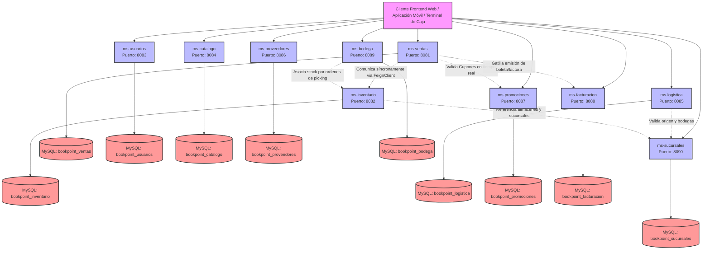

# BookPoint - Arquitectura Distribuida

BookPoint es una plataforma empresarial moderna y altamente escalable diseñada bajo un modelo de arquitectura de microservicios. Su propósito de negocio es digitalizar y optimizar de extremo a extremo las operaciones omnicanales B2C (Venta física en cajas de sucursal y comercio electrónico) y los flujos de abastecimiento B2B (Relaciones con editoriales y distribuidoras) de una cadena de librerías a nivel nacional.

---

## 1. Visión General del Ecosistema

La plataforma divide sus responsabilidades operativas e impositivas en **10 microservicios autónomos y desacoplados**, cada uno gobernando su propio dominio de negocio y persistencia de datos (base de datos por microservicio). El ecosistema está diseñado bajo el patrón **Client-Side Rendering (CSR)**, donde cada servicio expone interfaces RESTful con respuestas JSON uniformes, interoperabilidad CORS nativa, y esquemas de validación de datos blindados.

---

## 2. Diagrama de Arquitectura Global (Mermaid)

El siguiente flujo arquitectónico ilustra la distribución de responsabilidades de los 10 microservicios, sus puertos locales, bases de datos dedicadas, y los canales clave de intercomunicación:



---

## 3. Stack Tecnológico y Estándares de Ingeniería

El ecosistema digital de BookPoint se rige bajo los más altos estándares de desarrollo y patrones de diseño modernos, garantizando la consistencia, estabilidad y unificación del código fuente en toda la red:

*   **Java 17 & Spring Boot 3.x:** La base tecnológica y plataforma de ejecución de todos los microservicios. Aporta inyección de dependencias, compilación reactiva, soporte nativo de tipos (Records, Patrón de Bloques de Código) y contenedores REST auto-contenidos.
*   **Spring Data JPA & Hibernate:** ORM unificado para la persistencia relacional transaccional orientada a objetos hacia bases de datos MySQL, forzando índices únicos relacionales a nivel de base de datos para la protección de la integridad de los datos.
*   **Bean Validation (JSR 380):** Validación estricta y declarativa de campos e inputs en DTOs mediante anotaciones como `@NotBlank`, `@NotNull`, `@Min`, `@Max`, `@Positive`, interceptados mediante `@Valid` a nivel de los controladores HTTP.
*   **Spring Cloud OpenFeign:** Cliente HTTP declarativo empleado por `ms-ventas` para consultar en tiempo real el stock del producto en `ms-inventario` antes de autorizar cualquier transacción comercial.
*   **SLF4J (Simple Logging Facade for Java):** Fachada de logueo inyectada con Lombok (`@Slf4j`) en los servicios de negocio para emitir auditorías logs detalladas (`log.info`) y alertar incidencias o violaciones de negocio (`log.warn`).

### Estándares del Cumplimiento de Rúbrica:
1.  **Patrón CSR Estricto:** Arquitectura limpia desacoplada por capas (`controller`, `service`, `repository`, `model`, `dto` y `exception`) donde la lógica comercial reside exclusivamente en la capa de servicios y los endpoints exponen datos directamente en JSON raw (sin uso de motores de renderizado en servidor como JSP o Thymeleaf).
2.  **Manejo Global de Excepciones:** Cada microservicio incorpora un interceptor `@RestControllerAdvice` corporativo que captura excepciones comerciales personalizadas y retornos de validación, respondiendo uniformemente un objeto `ErrorResponse` limpio con estados de código HTTP correctos (400 Bad Request, 404 Not Found, 409 Conflict).
3.  **Data Seeder Automatizado:** Todos los microservicios cuentan con implementaciones de `CommandLineRunner` que inyectan de manera inteligente datos semillas específicos al arrancar (siempre y cuando la base de datos se encuentre vacía), facilitando la realización inmediata de pruebas por parte de evaluadores y desarrolladores.

---

## 4. Catálogo de Microservicios

A continuación se detalla la matriz de distribución, puertos, bases de datos y responsabilidades de la plataforma:

| Nombre del Microservicio | Puerto Local | Base de Datos MySQL | Responsabilidad Principal |
| :--- | :---: | :--- | :--- |
| **`ms-ventas`** | `8081` | `bookpoint_ventas` | Transacciones omnicanal, descuentos y orquestador de compras. Comunica con ms-inventario. |
| **`ms-inventario`** | `8082` | `bookpoint_inventario` | Control de stock físico, alertas de reposición y traslados. |
| **`ms-usuarios`** | `8083` | `bookpoint_usuarios` | Gestión de identidades, autenticación y roles B2C/B2B. |
| **`ms-catalogo`** | `8084` | `bookpoint_catalogo` | Vitrina pública de libros, paginación dinámica y sistema de reseñas. |
| **`ms-logistica`** | `8085` | `bookpoint_logistica` | Máquina de estados de despachos y ruteador inteligente de zonas (Hualpén/Concepción). |
| **`ms-proveedores`** | `8086` | `bookpoint_proveedores` | Abastecimiento B2B, órdenes de compra y recepción de mercadería. |
| **`ms-promociones`** | `8087` | `bookpoint_promociones` | Motor de reglas de marketing y validación de vigencia de cupones. |
| **`ms-facturacion`** | `8088` | `bookpoint_facturacion` | Motor tributario (IVA 19% Chile) y emisión de boletas/facturas. |
| **`ms-bodega`** | `8089` | `bookpoint_bodega` | Gestión de ubicaciones físicas y armado de pedidos (Picking). |
| **`ms-sucursales`** | `8090` | `bookpoint_sucursales` | Maestro de datos geográficos de tiendas físicas. |

---

## 5. Guía de Despliegue Local Rápido

Para desplegar y verificar localmente el ecosistema distribuido completo, siga los siguientes pasos de ingeniería:

### Paso 1: Levantar el Servidor de Bases de Datos
1.  Encienda su servidor MySQL corriendo localmente (ej: MySQL Community Server o Apache MySQL mediante paneles de control como **XAMPP**).
2.  Asegúrese de que el puerto por defecto de su servidor MySQL sea el `3306`.

### Paso 2: Creación de Esquemas de Base de Datos
Acceda a su cliente MySQL (PhpMyAdmin, DBeaver, MySQL Workbench o terminal) y ejecute las siguientes sentencias SQL para crear las 10 bases de datos relacionales vacías (el motor JPA autogenerará las tablas gracias a la propiedad `ddl-auto=update`):

```sql
CREATE DATABASE bookpoint_ventas;
CREATE DATABASE bookpoint_inventario;
CREATE DATABASE bookpoint_usuarios;
CREATE DATABASE bookpoint_catalogo;
CREATE DATABASE bookpoint_logistica;
CREATE DATABASE bookpoint_proveedores;
CREATE DATABASE bookpoint_promociones;
CREATE DATABASE bookpoint_facturacion;
CREATE DATABASE bookpoint_bodega;
CREATE DATABASE bookpoint_sucursales;
```

### Paso 3: Descarga de Dependencias e Inicio de los Microservicios
Para levantar cada microservicio en su puerto local preconfigurado, abra una terminal para cada uno de los directorios de servicios y ejecute los siguientes comandos de Maven:

```bash
# Ejemplo de compilación y levantamiento (Repetir en los 10 directorios)
mvn clean compile
mvn spring-boot:run
```

#### Orden Recomendado de Levantamiento Logístico:
1.  **`ms-sucursales`** (Puerto 8090) - Proveedor principal de locaciones físicas.
2.  **`ms-inventario`** (Puerto 8082) - Proveedor de stock.
3.  **`ms-usuarios`** (Puerto 8083) - Gobernador de identidades.
4.  **`ms-promociones`** (Puerto 8087) - Proveedor de cupones.
5.  **`ms-catalogo`** (Puerto 8084) - Vitrina comercial.
6.  **`ms-facturacion`** (Puerto 8088) - Emisor de facturas y boletas.
7.  **`ms-bodega`** (Puerto 8089) - Coordinador de picking.
8.  **`ms-logistica`** (Puerto 8085) - Coordinador de despachos.
9.  **`ms-proveedores`** (Puerto 8086) - Gobernador B2B.
10. **`ms-ventas`** (Puerto 8081) - Transacciones omnicanal finales.
